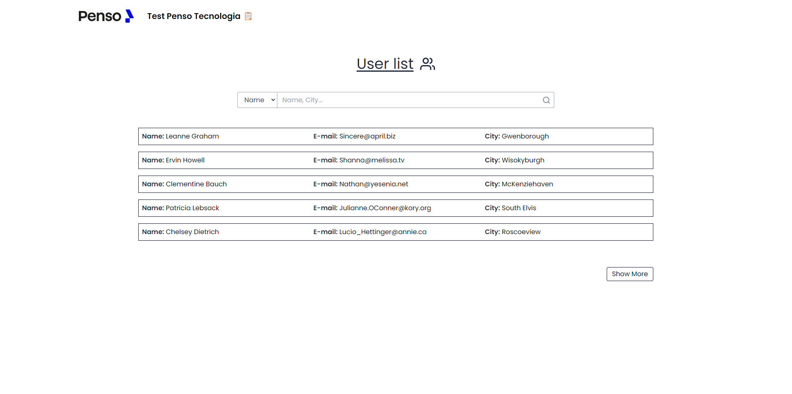

###  Teste para vaga de Desenvolvedor Front-end Jr

Este teste consiste em consumir um JSON com usuários, listar eles em uma página, e também criar um filtro para procurar usuários pelo nome ou cidade. Eu consumi o JSON utilizando a Fetch API do Javascript e utilizei ReactJS para a construção front end.

Você pode visualizar o projeto em produção, o deploy foi feito na Vercel. [Projeto em produção](https://teste-penso-tecnologia.vercel.app/)

### 🛠️ Stack

  - ReactJS
  - TailwindCSS
  - Typescript
  
### 📋 Como rodar o projeto
  
  - Tenha o node na versão 16 para cima na sua máquina.
  - Clone o projeto para a sua máquina.
  - Entre na pasta do projeto pelo terminal.
  - Rode o comando `yarn dev` e pronto!

---

### 📸 Screenshot

  
  
  
